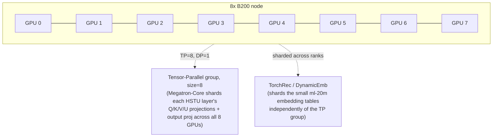
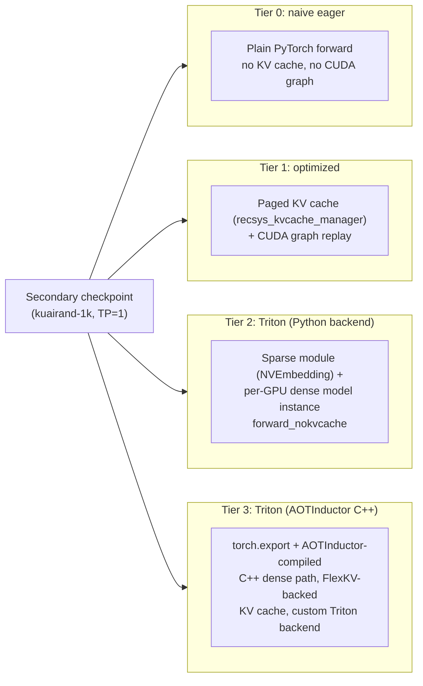

# Architecture

Background, model sizing math, and parallelism rationale for the HSTU
train+serve pipeline in this repo. Written for an architect audience deciding
whether/how to run something like this in production.

## 1. What HSTU is, and why it's interesting

HSTU (**H**ierarchical **S**equential **T**ransduction **U**nit) is the
architecture from Meta's *Actions Speak Louder than Words: Trillion-Parameter
Sequential Transducers for Generative Recommendations*
([arXiv:2402.17152](https://arxiv.org/abs/2402.17152)). The core idea:
reformulate recommendation as a **generative sequential transduction**
problem, structurally identical to next-token prediction in an LLM, instead of
the classic DLRM-style "featurize + MLP tower" ranking model. Concretely:

- A user's interaction history (items watched/clicked/rated, in order) is
  treated as a token sequence, interleaved with candidate items to be
  scored/ranked.
- A stack of HSTU layers (a self-attention variant fusing U/V/Q/K projections
  and a pointwise nonlinearity into one block, avoiding a separate FFN) then
  processes this sequence causally, exactly like a decoder-only transformer.
- Because it's structurally an autoregressive transformer, **it scales with
  compute the same way LLMs do** -- more layers/width/data keeps helping,
  which is the core thesis of the paper (they scale to ~1.5T parameters) and
  the reason this is a meaningful target for a from-scratch training exercise
  rather than a toy model.
- HSTU also introduces a custom fused attention kernel tuned for the very long
  (thousands of tokens), highly skewed (power-law item popularity) sequences
  typical of recommendation, reporting 5.3-15.2x speedup over FlashAttention-2
  at 8192-length sequences in the paper.

This repo builds on **[NVIDIA/recsys-examples](https://github.com/NVIDIA/recsys-examples)**
(`examples/hstu`, pinned to `v26.06.01`), the actively-maintained reference
implementation with Blackwell (`sm_100`) support, Megatron-Core distributed
training, TorchRec/DynamicEmb embedding sharding, and four distinct inference
serving paths -- i.e. exactly the pieces this exercise needs, rather than
reimplementing HSTU from the paper.

## 2. Model sizing math

The dense (non-embedding) parameter count per HSTU layer, reverse-engineered
from the upstream memory estimator
(`training/benchmark/scripts/estimate_memory.py`):

```
params/layer ≈ H·4·N·D + 4·N·D + N·D·H + H + 4·H
```

where `H` = `hidden_size`, `N` = `num_attention_heads`, `D` = `kv_channels`.
HSTU fuses the U/V/Q/K projections and the pointwise nonlinearity into one
block (no separate FFN sublayer like a classic GPT block), so with the usual
constraint `N·D = H` this simplifies to:

```
params/layer ≈ 5·H²
```

(A classic GPT-style transformer block is ≈12·H²/layer -- attention QKVO
[4H²] + FFN up/down [8H²] -- so HSTU needs a somewhat larger `H` or more
layers to hit the same total parameter count as an equivalent-depth GPT
model; that's expected and fine, since here we're targeting a parameter
budget, not benchmarking against a specific transformer variant.)

**HSTU-8B** (`configs/hstu_8b_ranking_*.gin`): `hidden_size=8192`,
`num_layers=24`, `num_attention_heads=64`, `kv_channels=128` (so `N·D=8192=H`,
as required) →

```
5 × 24 × 8192² ≈ 8.05 × 10⁹ dense params
```

comfortably inside the requested 7-10B band. **HSTU-10B**
(`configs/hstu_10b_ranking_ml20m.gin`, optional stretch config) is the same
shape with `num_layers=30` → `5 × 30 × 8192² ≈ 10.07 × 10⁹`.

Embedding tables add only a few hundred MB to a few GB on top of this,
because both benchmark datasets have small-to-moderate item vocabularies
(ml-20m: ~27K items; KuaiRand-1K: ~4.4M items) relative to the 8B-parameter
dense backbone -- i.e. this is deliberately an **infra/compute stress test of
the dense transformer backbone**, not an embedding-table capacity stress test
(that would be a different, equally valid exercise with a billion-row ID
space, e.g. KuaiRand-27K or a real production catalog).

## 3. Sequence length choice

`max_history_seqlen=2048`, `max_num_candidates=64` on ml-20m →
attention sequence length ≈ `1 + (2048+64)×2 ≈ 4225` tokens/user (contextual
token + interleaved history/candidate tokens, doubled per the upstream
convention of alternating item/action tokens). This is deliberately in HSTU's
long-sequence sweet spot, where the fused attention kernel's advantage over
stock FlashAttention-2 is largest per the paper -- i.e. it gives a meaningful,
representative infra story rather than a short-sequence case where the kernel
choice barely matters.

## 4. Two datasets, two different jobs

| | Primary: `ml-20m` | Secondary: `kuairand-1k` |
|---|---|---|
| Role | Main training deliverable | Serving-benchmark checkpoint |
| Parallelism | **TP=8** (Megatron-Core tensor parallel across the node) | **TP=1** (DP=8, 8 independent replicas) |
| Why | ~27K items → dense-backbone-dominated memory profile; TP=8 needed so 8B params × ~16-20 bytes/param (bf16 weights + grads + fp32 Adam state) shards to ~16-20GB/GPU instead of ~130-160GB/GPU under pure replication | The upstream inference examples (`inference/inference_gr_ranking.py`, the Triton Python backend, the AOTInductor export path) hard-code their dataset/embedding assumptions to `kuairand-1k` and are demonstrated end-to-end **only** with a TP=1 checkpoint. Training TP=1 here sidesteps checkpoint-resharding risk entirely (a real unknown -- see below) at the cost of a second, shorter, independent training run |
| Time budget | `TRAIN_BUDGET_HOURS` (default 12h) | `SECONDARY_TRAIN_BUDGET_HOURS` (default 2h) |

**Why not reshard the ml-20m TP=8 checkpoint down to TP=1 for serving
instead of training a second model?** Megatron-Core's newer distributed
checkpoint format can reshard across different TP degrees at load time, but
whether that's wired up end-to-end in the exact recsys-examples version
pinned here (particularly through the DynamicEmb/TorchRec embedding path,
not just the dense Megatron weights) isn't something we could verify without
running it -- so rather than build the serving comparison on top of an
unverified resharding step, this pipeline sidesteps the question entirely by
training a second, TP=1, single-GPU-servable checkpoint on the dataset the
serving examples already assume. Both runs share the identical dense
architecture (same gin `NetworkArgs`), so training MFU/TFLOPS numbers are
still directly comparable between the two datasets in `docs/RESULTS.md`.

## 5. Parallelism strategy (primary run)



- **Tensor parallelism (TP=8)**: the entire node is one TP group for the
  dense HSTU backbone. This is the right call here specifically because
  world_size (8) and the memory-bound axis (per-GPU optimizer state for an 8B
  model) line up exactly -- with 1 node, TP=8 gives the maximum memory
  reduction available without sequence or pipeline parallelism, and 8B dense
  params easily fits the intra-node NVLink bandwidth budget for the
  all-reduces TP introduces at every layer.
- **Data parallelism**: `world_size / tensor_model_parallel_size = 1` for the
  primary run (all 8 GPUs are one TP group, no DP replication) -- appropriate
  given the model itself, not the dataset, is the memory bottleneck here.
- **Embedding sharding**: handled independently by TorchRec/DynamicEmb, not
  tied to the TP degree -- for ml-20m's tiny (~27K-row) tables this barely
  matters, but the same mechanism would matter a lot for KuaiRand-27K/real
  production catalogs.
- Exact batch size is **not guessed** -- `scripts/04_size_model.sh` projects
  per-GPU memory across a batch-size sweep using the upstream memory
  estimator (with a manual TP-division correction -- see the script's header
  comment for why: the estimator itself does not divide by
  `tensor_parallel_size`), picks the largest batch size under a safety
  threshold, then validates that projection with a real short training run
  before committing to the full multi-hour job.

## 6. Four serving tiers



Each tier is swept over `BENCH_BATCH_SIZES` (default `1,2,4,8,16,32,64`) via a
custom client (`scripts/lib/bench_*.py`) that measures p50/p90/p99 latency and
throughput (items/sec) -- the upstream reference scripts for tiers 0/1 only
report an aggregate total-time-over-dataset number, so this pipeline adds
per-request percentile instrumentation around the *same* model-building and
forward-call code paths rather than reimplementing HSTU's batch construction
from scratch (lower risk of subtly getting the jagged-tensor input format
wrong). **Tier 3 is benchmarked at a single batch size**, not swept, because
AOTInductor compiles static shapes -- see `scripts/07_serving_bench.sh`'s
header for the exact tradeoff.

Tier 3 is also the highest-risk phase of the entire pipeline: it's the
deepest, least generic part of the upstream reference (custom C++ build,
FlexKV KV-cache server process, AOTI packaging, a *second*, separate Docker
image just for the Triton AOTI runtime). `scripts/06_export_checkpoint.sh`
treats it as best-effort -- a failure there is recorded, not fatal, and
`docs/RESULTS.md` simply reports Tier 3 as unavailable rather than the whole
pipeline aborting.

## 7. Why Docker, and why the image takes so long to build

No prebuilt recsys-examples image is published; the environment is built from
`docker/Dockerfile` (base `nvcr.io/nvidia/pytorch:26.05-py3`) which compiles
FBGEMM's HSTU CUDA kernels from source (~55min documented upstream) and
builds Triton Inference Server from source for the Python backend, on top of
Megatron-Core/TorchRec/FlashAttention/FlexKV. This is the single biggest fixed
cost in the whole pipeline, which is why `scripts/run_all.sh` launches it in
the background immediately and overlaps it with dataset download/preprocessing
(pure CPU/network work) rather than waiting on it serially.
